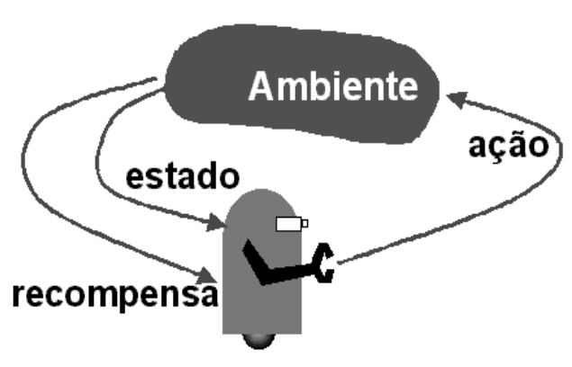

# Introdução {#intro}
Esse projeto visa o desenvolvimento de técnicas da área de Inteligência Artificial para o jogo de Space Invaders. Especificamente almeja-se a implementação de IAs para as naves inimigas. A maior parte da pesquisa nessa área se dá no desenvolvimento de Agentes que aprendem a jogar contra o ambiente, no estilo de um processo de decisão de Markov conforme ilustramos na Figura \@ref(fig:pdm):


```{r pdm, fig.align="center", echo=FALSE,  out.width = '50%', fig.cap = "Processo de decisão de markov. [@faria1999explorando]"}

```

O SpaceInvaders aqui desenvolvido almeja no entanto politicas de controle para o ambiente, que seriam os inimigos. O jogador(humano) se torna o ambiente nesse caso. Para que fosse possível a implementação das técnicas de IA, foi necessário o desenvolvimento do jogo, de um simulador, e de um surrogate para o jogador. 
Os objetivos deste trabalho são listados a seguir:

1. Construção do jogo de Space Invaders eficiente em C.
2. Construção de um Forward Simulator
3. Desenvolvimento de um surrugate Player que substitua o humano em tempo de planning ou treino.
4. Implementação de Técnicas de IA (Planning e Aprendizado)

# Desafio 

O jogo de Space Invaders tem 2 principais desafios: o primeiro é, como vários jogos similares, o número enorme de estados possível, tornando inviável a utilização de métodos exatos ou programação dinâmica para computar a política ótima. O segundo problema, mais particular ao jogo, é o fato de que o agente controla as naves oponentes, aumentando assim o espaço de ações enormemente. Dado que nessa versão do jogo os oponentes tem 5 ações possíveis, 4 direções e tiro, e temos 3 oponentes, o número de ações possíveis vai ser 5*5*5 = 125 ações. O numero pequeno de oponentes é proposital, pois o espaço de ações cresce muito, tornando inviável as técnicas aqui descritas. Versões mais eficientes estão em desenvolvimento.

No capítulo \@ref(methods) descrevemos as técnicas utilizadas neste trabalho, e no capítulo \@ref(app) descrevemos a implementação como um todo.
