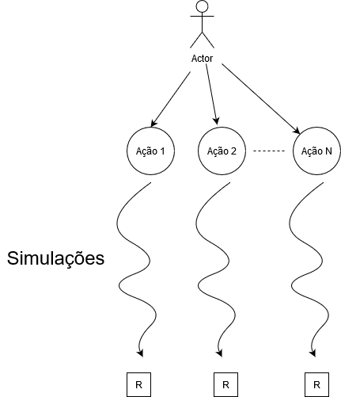
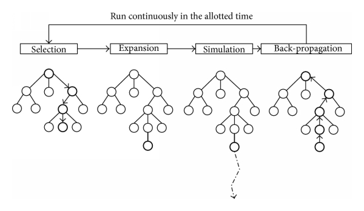

# Metodologia {#methods}
Descrevemos aqui os métodos utilizados neste projeto. Importante: a recompensa é +1 pra cada dano recebido pela nave do jogador( do ponto de vista dos oponente, os quais estamos tentanto otimizar) e -1 pra cada dano recebido pela nave oponente. Além disso, +100 é dado de o tiro inimigo matar o oponente, e -100 é recebido se uma nave inimiga morrer.

## Neural Network
Uma rede neural de 1 camada escondida foi treinada com busca aleatória no espaço de pesos. O processo é muito simples, com a rede sendo avaliada em um número de partidas com os pesos gerados, e caso ela seja a melhor rede até agora( no acúmulo de recompensas), salvamos seus pesos e os modificamos em direções aleatória usando ruído gaussiano. O resultado foi aquém do esperado, talvez devido a complexidade do problema e a esparcidade das recompensas, que ocorrem com pouca frequência.
## Monte Carlo 1-Step Planning
Utiliza-se simulação monte carlo para se estimar o retorno esperado de cada ação possível no estado atual. Rollouts/playouts/partidas aleatórias são simuladas até certo passo estipulado. A recompensa acumulada até aquele passo é utilizada como estimativa do retorno esperado. Quanto mais simulações melhor, logo é importante a velocidade do simulador. O funcionamento é ilustrado na figura abaixo:

```{r fig.align="center", echo=FALSE,  out.width = '50%'}

```

Por causa do enorme número de ações, esse método se torna menos eficiente. Melhorias possíveis são a utilização de métodos que selecionam subconjuntos de ações disponíveis. 
## Monte Carlo Tree Search
O método de melhor resultado, é uma melhoria do MC onde se constroi uma árvore de ações na memória. Seu funcionamento se dá pelos 4 passos ilustrados na figura abaixo:

```{r fig.align="center", echo=FALSE,  out.width = '50%'}

```

## Reinforcement Learning

