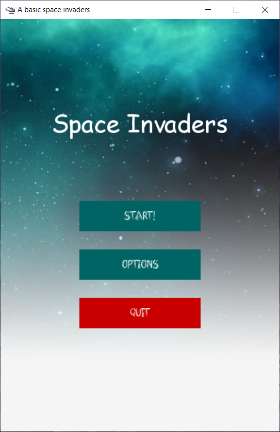

--- 
title: "Space Invaders - IA"
author: "Ivan de Jesus Pereira Pinto"
date: "`r Sys.Date()`"
site: bookdown::bookdown_site
output: bookdown::gitbook
documentclass: book
bibliography: [book.bib, packages.bib]
biblio-style: apalike
link-citations: yes
github-repo: rstudio/bookdown-demo
description: "Relatório para a disciplina de IA em jogos."
---

# Resumo {-}
___

```{r fig.align="center", echo=FALSE,  out.width = '50%'}

```

Neste relatório descrevemos as técnicas utilizadas nos agentes do jogo _space invaders_, além do processo de treinamento. 

<!--

```{r include=FALSE}
# automatically create a bib database for R packages
knitr::write_bib(c(
  .packages(), 'bookdown', 'knitr', 'rmarkdown'
), 'packages.bib')
```
-->
